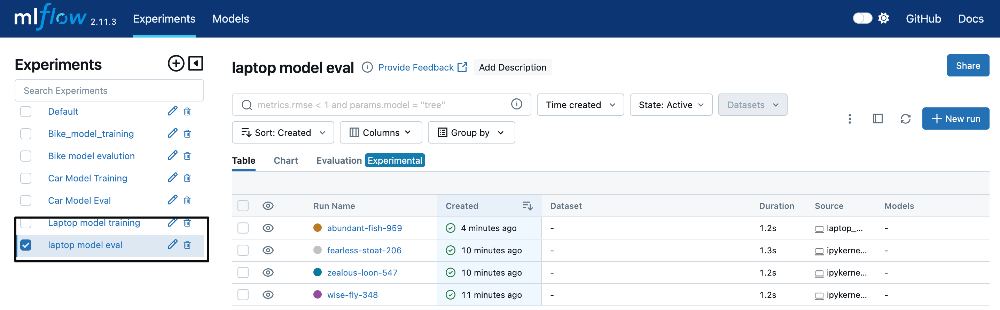
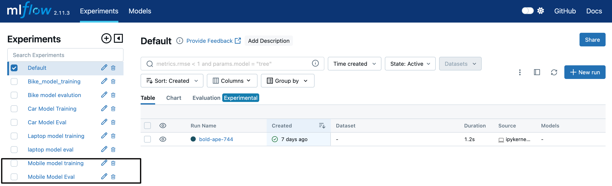

# 95Mobiles

1. create a virtual env
conda create -n 95m python=3.12 -y
2. Create an log file
3. Create an project str
4. install dependencies
pip install -r requirements.txt

# Bike Price Predictions
1. Exp done for end to end
2. data ingestion for bike done
3. feature eng done
4. data splitting done
5. Hyper parameter tuninng with mlflow

6. model evaluatuion done with mlflow

7. Application added

# Car price prediction
1. Exp done for end to end
2. data ingestion for car done
3. feature eng done
4. data splitting done
5. Hyper parameter tuninng with mlflow
6. model evaluatuion done with mlflow

7. Application added

# Laptop Price prediction
1. Exp done for end to end
2. data ingestion for laptop done
3. feature eng done
4. data splitting done
5. Hyper parameter tuninng with mlflow
6. model evaluatuion done with mlflow

7. Application added

# Mobile Price prediction
1. Exp done for end to end
2. data ingestion for Mobile done
3. feature eng done
4. data splitting done
5. Hyper parameter tuninng with mlflow
6. model evaluatuion done with mlflow

7. Application added

# DVC 
1. dvc init
2. dvc status
3. dvc dag
4. dvc repro

# Add git hooks
## git hook cmds
1. cd .git/hooks
2. nano pre-commit
save ->control+o, press enter then control+x for exist
 just add the below script

#!/bin/bash

echo "Pre-commit hook triggered."
dvc repro
status=$?

# Check if dvc repro succeeded
if [ $status -ne 0 ]; then
  echo "dvc repro failed with status $status. Commit aborted."
  exit 1  # Abort the commit
else
  echo "dvc repro completed successfully."
fi

push the changes

# Dockerize
1. # Dockerize 
### run this project in local docker
1. docker build -t 95m .
cfc is my docker image name
2. docker run -p 8080:8080 95m

# 1. Login to AWS console.
# 2. Create IAM user for deployment

#with specific access

1. EC2 access : It is virtual machine

2. ECR: Elastic Container registry to save your docker image in aws

#Description: About the deployment

1. Build docker image of the source code

2. Push your docker image to ECR

3. Launch Your EC2 

4. Pull Your image from ECR in EC2

5. Lauch your docker image in EC2

# Policy:

1. AmazonEC2ContainerRegistryFullAccess

2. AmazonEC2FullAccess
3. Create ECR repo to store/save docker image
- Save the URI: 566373416292.dkr.ecr.us-east-1.amazonaws.com/text-s
4. Create EC2 machine (Ubuntu)
5. Open EC2 and Install docker in EC2 Machine:
#optinal

sudo apt-get update -y

sudo apt-get upgrade

#required

curl -fsSL https://get.docker.com -o get-docker.sh

sudo sh get-docker.sh

sudo usermod -aG docker ubuntu

newgrp docker
# 6. Configure EC2 as self-hosted runner:
setting>actions>runner>new self hosted runner> choose os> then run command one by one
# 7. Setup github secrets:
AWS_ACCESS_KEY_ID=

AWS_SECRET_ACCESS_KEY=

AWS_REGION = us-east-1

AWS_ECR_LOGIN_URI = demo>>  566373416292.dkr.ecr.ap-south-1.amazonaws.com

ECR_REPOSITORY_NAME = simple-app

