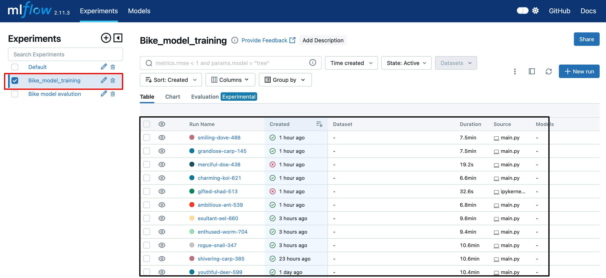
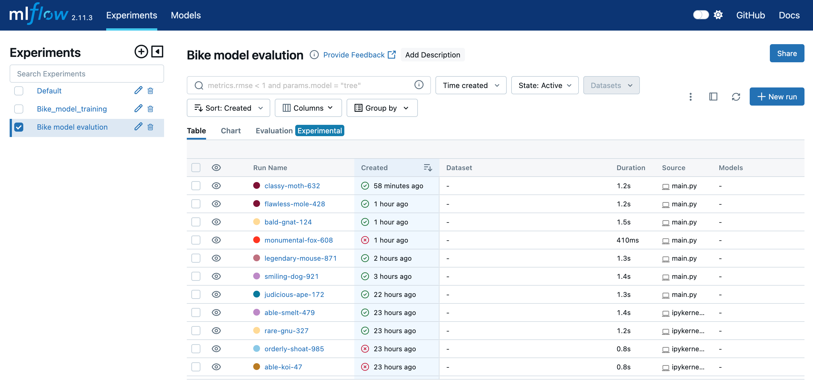
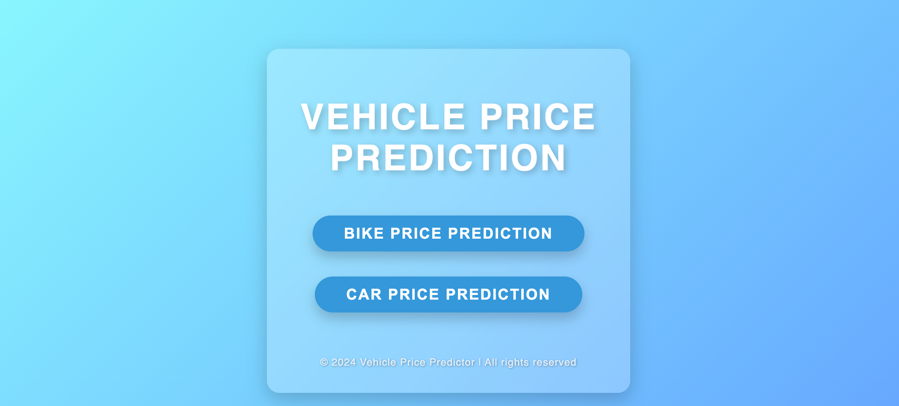
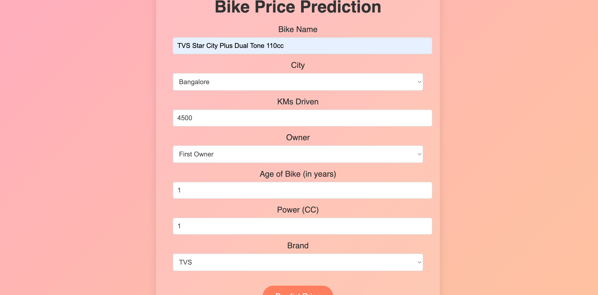
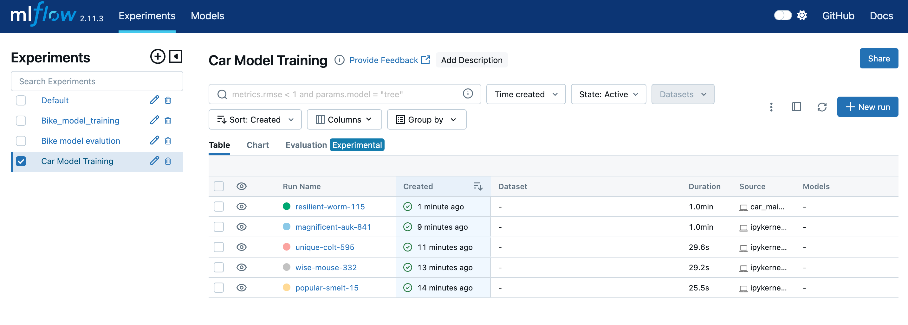
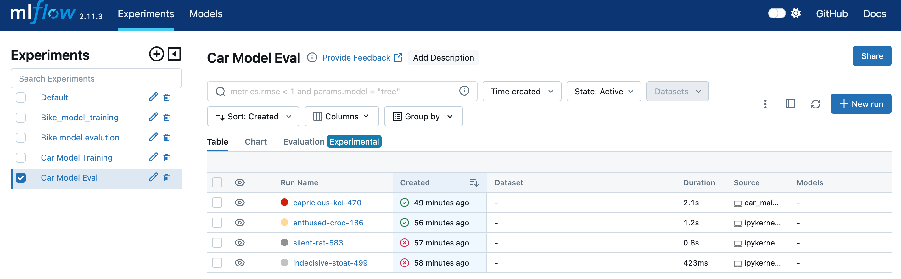

# 95Mobiles

1. create a virtual env
conda create -n 95m python=3.12 -y
2. Create an log file
3. Create an project str
4. install dependencies
pip install -r requirements.txt

# Bike Price Predictions
1. Exp done for end to end
2. data ingestion for bike done
3. feature eng done
4. data splitting done
5. Hyper parameter tuninng with mlflow

6. model evaluatuion done with mlflow

7. Application added

# Car price prediction
1. Exp done for end to end
2. data ingestion for bike done
3. feature eng done
4. data splitting done
5. Hyper parameter tuninng with mlflow

6. model evaluatuion done with mlflow

7. Application added

# DVC 
1. dvc init
2. dvc status
3. dvc dag
4. dvc repro

# Add git hooks
## git hook cmds
1. cd .git/hooks
2. nano pre-commit
save ->control+o, press enter then control+x for exist
 just add the below script

#!/bin/bash

echo "Pre-commit hook triggered."
dvc repro
status=$?

# Check if dvc repro succeeded
if [ $status -ne 0 ]; then
  echo "dvc repro failed with status $status. Commit aborted."
  exit 1  # Abort the commit
else
  echo "dvc repro completed successfully."
fi

push the changes

# Dockerize
1. # Dockerize 
### run this project in local docker
1. docker build -t 95m .
cfc is my docker image name
2. docker run -p 8080:8080 95m

